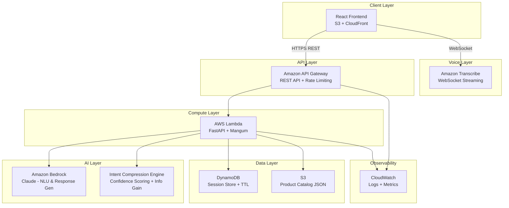
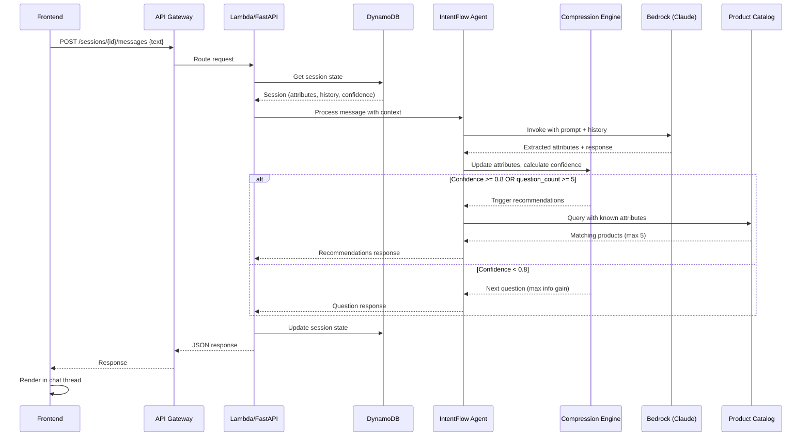
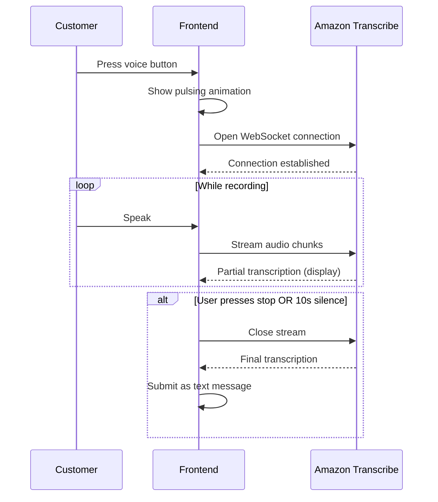
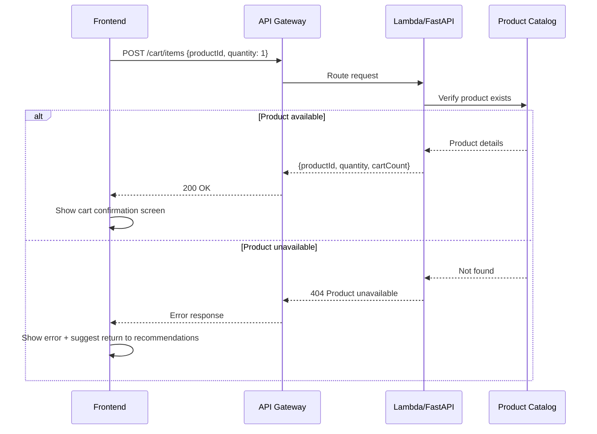

# Design Document: IntentFlow

## Overview

IntentFlow is an AI-driven conversational commerce experience for Amazon Now that replaces traditional browse-filter-compare shopping with a progressive intent narrowing conversation. The system uses an Intent Compression Engine to ask the minimum number of questions needed to understand customer needs, then delivers targeted product recommendations.

The architecture is fully serverless on AWS, using React for the frontend (S3 + CloudFront), API Gateway as the REST layer, Lambda (FastAPI) for compute, Amazon Bedrock (Claude) for NLU, Amazon Transcribe for voice, and DynamoDB for session persistence. This is a hackathon prototype designed to demonstrate the concept while showing a path to production scale.

### Key Design Decisions

| Decision | Choice | Rationale |
|----------|--------|-----------|
| Frontend framework | React (Vite) | Fast dev cycle, rich ecosystem, SPA routing |
| API framework | FastAPI + Mangum | Async support, auto-docs, Lambda-compatible via Mangum adapter |
| AI model | Amazon Bedrock (Claude) | Managed, no infra overhead, strong NLU capability |
| Voice | Amazon Transcribe WebSocket | Real-time streaming, low latency |
| Session store | DynamoDB | Serverless, TTL support, single-digit-ms reads |
| Hosting | S3 + CloudFront | Global CDN, zero-server frontend |
| Auth | Mock (X-User-Id header) | Prototype simplicity, easy to swap for Cognito later |

## Architecture

### High-Level Architecture Diagram



### Request Flow Summary

1. Customer interacts via text or voice on the React frontend
2. Voice input streams to Amazon Transcribe, which returns transcribed text
3. Frontend sends text to API Gateway (`POST /sessions/{id}/messages`)
4. API Gateway validates request and routes to Lambda
5. Lambda loads session from DynamoDB, invokes Bedrock with context
6. Intent Compression Engine evaluates confidence, selects next action
7. Response (question or recommendations) returned through the chain
8. Frontend renders response in chat thread

## Components and Interfaces

### 1. React Frontend (`frontend/`)

**Responsibilities:**
- Render homepage with category tiles
- Manage conversational shopping UI (chat thread, input, voice button)
- Handle voice recording and Transcribe WebSocket connection
- Display product recommendations and cart confirmation
- Client-side routing (React Router)
- Error handling and retry logic

**Key Components:**
```
src/
├── pages/
│   ├── HomePage.tsx          # Category tiles + voice CTA
│   ├── ChatPage.tsx          # Conversational shopping screen
│   └── CartConfirmation.tsx  # Add-to-cart success screen
├── components/
│   ├── CategoryTile.tsx      # Individual category card
│   ├── ChatThread.tsx        # Message list with auto-scroll
│   ├── ChatBubble.tsx        # User/agent message bubble
│   ├── TextInput.tsx         # Text input with send button
│   ├── VoiceButton.tsx       # Voice activation with pulsing animation
│   ├── RecommendationCard.tsx # Product recommendation card
│   ├── ProductDetail.tsx     # Full product view
│   └── LoadingIndicator.tsx  # Processing state indicator
├── hooks/
│   ├── useSession.ts         # Session creation and state management
│   ├── useChat.ts            # Message sending and receiving
│   ├── useVoice.ts           # Transcribe WebSocket management
│   └── useCart.ts            # Cart operations
├── services/
│   ├── api.ts                # API client (axios/fetch wrapper)
│   └── transcribe.ts         # Transcribe WebSocket client
├── types/
│   └── index.ts              # TypeScript interfaces
└── App.tsx                   # Router + layout
```

### 2. FastAPI Backend (`backend/`)

**Responsibilities:**
- Handle API requests (session, messages, recommendations, cart)
- Orchestrate IntentFlow Agent logic
- Interface with DynamoDB, Bedrock, and Product Catalog
- Request validation and error handling
- Structured logging

**Key Modules:**
```
backend/
├── main.py                   # FastAPI app + Mangum handler
├── routers/
│   ├── sessions.py           # POST /sessions, session management
│   ├── messages.py           # POST /sessions/{id}/messages
│   ├── recommendations.py   # GET /sessions/{id}/recommendations
│   └── cart.py               # POST /cart/items
├── services/
│   ├── intent_agent.py       # IntentFlow Agent orchestration
│   ├── compression_engine.py # Intent Compression Engine
│   ├── bedrock_client.py     # Amazon Bedrock integration
│   ├── session_store.py      # DynamoDB session CRUD
│   └── product_catalog.py    # Product catalog querying
├── models/
│   ├── session.py            # Session data model
│   ├── message.py            # Message data model
│   ├── product.py            # Product data model
│   └── cart.py               # Cart data model
├── middleware/
│   ├── auth.py               # X-User-Id extraction/generation
│   ├── correlation.py        # Request correlation ID
│   └── logging.py            # Structured JSON logging
└── config.py                 # Environment configuration
```

### 3. Intent Compression Engine (`backend/services/compression_engine.py`)

**Responsibilities:**
- Calculate confidence scores from known vs. required attributes
- Determine next best question via information gain maximization
- Trigger recommendation retrieval when confidence threshold met
- Enforce maximum 5-question limit per session

### 4. IntentFlow Agent (`backend/services/intent_agent.py`)

**Responsibilities:**
- Orchestrate the conversation flow
- Build Bedrock prompts with session context
- Extract attributes from Bedrock responses
- Route to compression engine or recommendation retrieval
- Format responses per Requirement 19 guidelines

### Component Interaction: Message Processing



### Component Interaction: Voice Input



### Component Interaction: Add to Cart



## Data Models

### DynamoDB Session Table Schema

**Table Name:** `intentflow-sessions`  
**Partition Key:** `sessionId` (String)  
**TTL Attribute:** `ttl` (Number - Unix epoch)

| Attribute | Type | Description |
|-----------|------|-------------|
| `sessionId` | String (UUID v4) | Primary key |
| `userId` | String | User identifier from X-User-Id header |
| `conversationHistory` | List<Map> | Messages (max 50), each with role, text, timestamp |
| `extractedAttributes` | Map | Known attributes: `{category, brand, priceRange, size, color, ...}` |
| `confidenceScore` | Number | 0.0 to 1.0 |
| `questionCount` | Number | Questions asked this session (max 5) |
| `createdAt` | String (ISO 8601) | Session creation timestamp |
| `updatedAt` | String (ISO 8601) | Last update timestamp |
| `ttl` | Number | Unix epoch, set to `updatedAt + 30 minutes` |

**GSI:** `userId-index`  
- Partition Key: `userId`  
- Sort Key: `createdAt`  
- Purpose: Retrieve all sessions for a user

**Example Item:**
```json
{
  "sessionId": "a1b2c3d4-e5f6-7890-abcd-ef1234567890",
  "userId": "user-abc-123",
  "conversationHistory": [
    {"role": "user", "text": "I need running shoes", "timestamp": "2024-01-15T10:30:00Z"},
    {"role": "agent", "text": "I'd love to help you find running shoes! What's your budget range?", "timestamp": "2024-01-15T10:30:02Z"}
  ],
  "extractedAttributes": {
    "category": "Fashion",
    "subcategory": "shoes",
    "type": "running"
  },
  "confidenceScore": 0.4,
  "questionCount": 1,
  "createdAt": "2024-01-15T10:30:00Z",
  "updatedAt": "2024-01-15T10:30:02Z",
  "ttl": 1705314600
}
```

### Product Catalog Schema (S3 JSON)

**Location:** `s3://intentflow-catalog/products.json`

```json
{
  "products": [
    {
      "productId": "PROD-001",
      "title": "Nike Air Zoom Pegasus 40",
      "category": "Fashion",
      "brand": "Nike",
      "price": 2499,
      "size": "9",
      "color": "Black",
      "rating": 4.5,
      "imageUrl": "https://cdn.example.com/products/nike-pegasus-40.jpg",
      "attributes": {
        "subcategory": "shoes",
        "type": "running",
        "gender": "unisex",
        "priceRange": "2000-3000"
      }
    }
  ],
  "categories": {
    "Grocery": {
      "requiredAttributes": ["category"],
      "optionalAttributes": ["brand", "priceRange", "dietary"],
      "discriminativeOrder": ["brand", "priceRange", "dietary"]
    },
    "Fashion": {
      "requiredAttributes": ["category", "subcategory"],
      "optionalAttributes": ["brand", "size", "color", "priceRange", "gender"],
      "discriminativeOrder": ["subcategory", "brand", "priceRange", "size", "color", "gender"]
    },
    "Tools": {
      "requiredAttributes": ["category"],
      "optionalAttributes": ["brand", "priceRange", "type", "powerSource"],
      "discriminativeOrder": ["type", "brand", "priceRange", "powerSource"]
    },
    "Electronics": {
      "requiredAttributes": ["category", "type"],
      "optionalAttributes": ["brand", "priceRange", "size", "connectivity"],
      "discriminativeOrder": ["type", "brand", "priceRange", "size", "connectivity"]
    },
    "Essentials": {
      "requiredAttributes": ["category"],
      "optionalAttributes": ["brand", "priceRange", "type"],
      "discriminativeOrder": ["type", "brand", "priceRange"]
    }
  }
}
```

### API Request/Response Schemas

#### POST /sessions

**Request Headers:**
```
X-User-Id: string (optional, max 64 chars)
Content-Type: application/json
```

**Request Body:** _(empty or optional)_
```json
{
  "category": "Fashion"  // optional: pre-selected category from homepage
}
```

**Response (201 Created):**
```json
{
  "sessionId": "a1b2c3d4-e5f6-7890-abcd-ef1234567890",
  "message": "Hi! I'm here to help you find exactly what you need. What are you looking for today?",
  "userId": "user-abc-123"
}
```

#### POST /sessions/{sessionId}/messages

**Request Body:**
```json
{
  "text": "I need running shoes under 3000 rupees"
}
```

**Response (200 OK):**
```json
{
  "sessionId": "a1b2c3d4-e5f6-7890-abcd-ef1234567890",
  "response": {
    "type": "question",
    "text": "Great choice! Do you have a preferred brand, or should I find the best-rated options across brands?",
    "options": ["Nike", "Adidas", "Puma", "No preference"]
  },
  "metadata": {
    "confidenceScore": 0.6,
    "extractedAttributes": {"category": "Fashion", "subcategory": "shoes", "type": "running", "priceRange": "0-3000"},
    "questionCount": 1
  }
}
```

**Response (200 OK - Recommendations):**
```json
{
  "sessionId": "a1b2c3d4-e5f6-7890-abcd-ef1234567890",
  "response": {
    "type": "recommendations",
    "text": "Based on your preference for running shoes under ₹3000, here are my top picks!",
    "products": [
      {
        "productId": "PROD-001",
        "title": "Nike Air Zoom Pegasus 40",
        "price": 2499,
        "rating": 4.5,
        "imageUrl": "https://cdn.example.com/products/nike-pegasus-40.jpg"
      }
    ]
  },
  "metadata": {
    "confidenceScore": 0.85,
    "extractedAttributes": {"category": "Fashion", "subcategory": "shoes", "type": "running", "priceRange": "0-3000", "brand": "Nike"},
    "questionCount": 2
  }
}
```

#### GET /sessions/{sessionId}/recommendations

**Response (200 OK):**
```json
{
  "products": [
    {
      "productId": "PROD-001",
      "title": "Nike Air Zoom Pegasus 40",
      "category": "Fashion",
      "brand": "Nike",
      "price": 2499,
      "size": "9",
      "color": "Black",
      "rating": 4.5,
      "imageUrl": "https://cdn.example.com/products/nike-pegasus-40.jpg"
    }
  ],
  "explanation": "Based on your preference for Nike running shoes under ₹3000 in size 9."
}
```

#### POST /cart/items

**Request Body:**
```json
{
  "productId": "PROD-001",
  "quantity": 1
}
```

**Response (200 OK):**
```json
{
  "productId": "PROD-001",
  "title": "Nike Air Zoom Pegasus 40",
  "quantity": 1,
  "price": 2499,
  "cartItemCount": 1
}
```

#### Error Response Format (all endpoints)

```json
{
  "error": {
    "code": "SESSION_NOT_FOUND",
    "message": "The session could not be found or has expired.",
    "correlationId": "req-xyz-123"
  }
}
```

### Intent Compression Engine Algorithm

The Intent Compression Engine maximizes information gain per question to minimize the number of interactions before recommendation.

**Core Algorithm (Pseudocode):**

```python
def process_message(session: Session, new_attributes: dict) -> AgentAction:
    # 1. Merge new attributes into session
    session.extracted_attributes.update(new_attributes)
    session.question_count += 1  # if this was an answer to a question
    
    # 2. Calculate confidence score
    confidence = calculate_confidence(session)
    session.confidence_score = confidence
    
    # 3. Determine action
    if should_recommend(session, confidence):
        products = query_catalog(session.extracted_attributes)
        return AgentAction(type="recommendations", products=products)
    else:
        next_question = select_next_question(session)
        return AgentAction(type="question", text=next_question)


def calculate_confidence(session: Session) -> float:
    """
    Confidence = known_attributes / total_relevant_attributes
    
    Where total_relevant_attributes is the count of required + optional
    attributes for the identified category (or all categories if none identified).
    """
    category = session.extracted_attributes.get("category")
    
    if category is None:
        # Without category, confidence is very low
        return len(session.extracted_attributes) / 10.0  # rough estimate
    
    category_schema = CATALOG_SCHEMA[category]
    required = set(category_schema["requiredAttributes"])
    optional = set(category_schema["optionalAttributes"])
    all_attributes = required | optional
    
    known = set(session.extracted_attributes.keys()) & all_attributes
    
    # Weighted: required attributes count more
    required_known = known & required
    optional_known = known & optional
    
    # Required attributes get 2x weight
    weighted_known = (len(required_known) * 2) + len(optional_known)
    weighted_total = (len(required) * 2) + len(optional)
    
    return min(weighted_known / weighted_total, 1.0)


def should_recommend(session: Session, confidence: float) -> bool:
    """Decide whether to trigger recommendations."""
    # Hard limit: max 5 questions
    if session.question_count >= 5:
        return True
    
    # Confidence threshold reached
    if confidence >= CONFIDENCE_THRESHOLD:  # default 0.8
        return True
    
    # Few products match — no point asking more questions
    matching_count = count_matching_products(session.extracted_attributes)
    if matching_count > 0 and matching_count < 4:
        return True
    
    return False


def select_next_question(session: Session) -> str:
    """
    Select the attribute that maximizes information gain.
    
    Information gain = how many products an attribute value eliminates
    from the candidate set. Attributes that split the candidate set
    most evenly have highest information gain.
    """
    category = session.extracted_attributes.get("category")
    
    # Priority 1: If no category, ask for category first
    if category is None:
        return generate_category_question()
    
    # Get candidate products matching known attributes
    candidates = query_catalog(session.extracted_attributes)
    
    # Get unknown attributes, ordered by discriminative power
    category_schema = CATALOG_SCHEMA[category]
    discriminative_order = category_schema["discriminativeOrder"]
    known_keys = set(session.extracted_attributes.keys())
    
    unknown_attributes = [a for a in discriminative_order if a not in known_keys]
    
    if not unknown_attributes:
        return None  # Trigger recommendations
    
    # Select attribute with highest information gain
    best_attribute = None
    best_gain = -1
    
    for attr in unknown_attributes:
        gain = calculate_information_gain(candidates, attr)
        if gain > best_gain:
            best_gain = gain
            best_attribute = attr
    
    # Generate natural question via Bedrock
    return generate_question_for_attribute(best_attribute, session)


def calculate_information_gain(candidates: list, attribute: str) -> float:
    """
    Information gain approximated by entropy reduction.
    
    Higher gain = attribute values are more evenly distributed among candidates,
    meaning any answer eliminates roughly half the options.
    """
    from math import log2
    
    # Count products per attribute value
    value_counts = {}
    for product in candidates:
        value = product.get("attributes", {}).get(attribute, product.get(attribute, "unknown"))
        value_counts[value] = value_counts.get(value, 0) + 1
    
    total = len(candidates)
    if total == 0:
        return 0.0
    
    # Calculate entropy (higher entropy = more information gain from asking)
    entropy = 0.0
    for count in value_counts.values():
        if count > 0:
            p = count / total
            entropy -= p * log2(p)
    
    return entropy
```

**Key Properties:**
- Confidence monotonically increases as attributes are added (new info always helps)
- Category is always the first question if unknown (highest discriminative power)
- Maximum 5 questions hard cap ensures bounded conversation length
- Early recommendation trigger when candidate set is small (< 4 products)


## Correctness Properties

*A property is a characteristic or behavior that should hold true across all valid executions of a system — essentially, a formal statement about what the system should do. Properties serve as the bridge between human-readable specifications and machine-verifiable correctness guarantees.*

### Property 1: Whitespace message rejection

*For any* string composed entirely of whitespace characters (spaces, tabs, newlines, or any combination), the system SHALL reject the message submission and leave the conversation state unchanged.

**Validates: Requirements 3.3**

### Property 2: Session creation yields valid UUID v4

*For any* valid session creation request, the returned session ID SHALL be a valid UUID v4 string (matching the pattern `[0-9a-f]{8}-[0-9a-f]{4}-4[0-9a-f]{3}-[89ab][0-9a-f]{3}-[0-9a-f]{12}`).

**Validates: Requirements 4.1**

### Property 3: Session state round-trip preservation

*For any* valid session state (containing conversation history up to 50 messages, extracted attributes map, and confidence score between 0.0 and 1.0), writing the session to the store and then reading it back SHALL produce an identical session state.

**Validates: Requirements 4.2, 14.5**

### Property 4: Attribute merge semantics

*For any* existing attribute map E and any new extraction map N, merging N into E SHALL produce a result where: (a) every key in N has the value from N (override), and (b) every key in E that is not in N retains its original value (preservation).

**Validates: Requirements 5.2, 5.3**

### Property 5: Information gain maximization for question selection

*For any* set of candidate products and any set of unknown attributes, the Intent Compression Engine SHALL select the attribute with the highest information gain (entropy) score among all unknown attributes as the next question topic.

**Validates: Requirements 6.1, 6.4**

### Property 6: Confidence score correctness

*For any* category schema with R required attributes and O optional attributes, and any subset K of known attributes, the confidence score SHALL equal `(|K ∩ R| × 2 + |K ∩ O|) / (|R| × 2 + |O|)`, clamped to [0.0, 1.0].

**Validates: Requirements 6.2**

### Property 7: Confidence monotonicity

*For any* session state with confidence score C, adding one or more new known attributes (without removing any) SHALL result in a new confidence score C' where C' >= C.

**Validates: Requirements 6.3**

### Property 8: Recommendation trigger invariants

*For any* session state, `should_recommend` SHALL return `True` if ANY of: (a) question_count >= 5, (b) confidence_score >= 0.8, or (c) matching product count is between 1 and 3 inclusive. It SHALL return `False` only when none of these conditions hold.

**Validates: Requirements 6.6, 7.1, 7.3**

### Property 9: Recommendation sorting and limit

*For any* list of matching products, the recommendation result SHALL contain at most 5 products AND they SHALL be sorted in descending order by rating (products[i].rating >= products[i+1].rating for all valid i).

**Validates: Requirements 8.1**

### Property 10: Catalog query correctness

*For any* set of filter attributes and any product catalog, every product in the query result SHALL match ALL specified filters: exact match for categorical attributes (category, brand, color, size) and range containment for numeric attributes (price within requested range).

**Validates: Requirements 15.4, 15.5**

### Property 11: Prompt construction includes context window

*For any* conversation history of length N and any extracted attributes map, the prompt sent to Bedrock SHALL include exactly min(N, 20) most recent messages AND all key-value pairs from the extracted attributes map.

**Validates: Requirements 13.2**

### Property 12: Session persistence invariants

*For any* session update operation, the stored record SHALL: (a) have `updatedAt` set to the current timestamp (within 1 second tolerance), (b) contain all required fields (sessionId, conversationHistory, extractedAttributes, confidenceScore, createdAt, updatedAt), and (c) have TTL equal to the updatedAt Unix epoch + 1800 seconds.

**Validates: Requirements 14.2, 14.3, 14.4**

### Property 13: User ID validation

*For any* request, the system SHALL: (a) accept any non-empty string of 1-64 characters as a valid X-User-Id, (b) generate a valid UUID v4 and return it when X-User-Id header is absent, (c) return HTTP 400 when X-User-Id is empty or exceeds 64 characters.

**Validates: Requirements 18.1, 18.2, 18.4**

### Property 14: Response formatting constraints

*For any* agent response: (a) when options are presented, they SHALL be formatted as a numbered list of at most 5 items each no longer than 10 words, (b) question responses SHALL contain at most 2 sentences, (c) non-question responses SHALL contain at most 3 sentences.

**Validates: Requirements 19.2, 19.3**

## Error Handling

### Strategy

Error handling follows a layered approach where each layer handles what it can and propagates what it cannot:

| Layer | Responsibility | Behavior |
|-------|---------------|----------|
| Frontend | Network errors, timeouts, UI state | Display non-technical messages, preserve input, auto-retry (3x) |
| API Gateway | Rate limiting, routing, request validation | Return appropriate HTTP codes (400, 404, 429, 502, 504) |
| Lambda/FastAPI | Business logic errors, service orchestration | Log structured errors, return error responses |
| Bedrock Client | AI service errors | Retry once (15s timeout), return fallback message |
| DynamoDB Client | Persistence errors | Propagate without modifying state, timeout at 5s |

### Error Codes and HTTP Status Mapping

| Code | HTTP Status | Condition | User-Facing Message |
|------|------------|-----------|---------------------|
| `VALIDATION_ERROR` | 400 | Invalid request payload | "Please check your input and try again." |
| `INVALID_USER_ID` | 400 | Empty or >64 char X-User-Id | "Invalid user identifier format." |
| `SESSION_NOT_FOUND` | 404 | Non-existent or expired session | "Your session has expired. Let's start fresh!" |
| `RATE_LIMITED` | 429 | >100 req/min per user | "You're going too fast. Please wait a moment." |
| `PROCESSING_ERROR` | 502 | Unhandled Lambda exception | "Something went wrong. Please try again." |
| `SERVICE_UNAVAILABLE` | 503 | DynamoDB timeout (>5s) | "We're experiencing high demand. Try again shortly." |
| `GATEWAY_TIMEOUT` | 504 | Lambda timeout (>29s) | "This is taking too long. Please try again." |

### Frontend Error Recovery

```typescript
// Retry strategy
const RETRY_CONFIG = {
  maxRetries: 3,
  backoffMs: [1000, 2000, 4000], // exponential backoff
  preserveInput: true,           // keep message in input on failure
};

// Connection monitoring
// - Detect disconnection within 2 seconds
// - Show "Connection lost" indicator
// - Queue failed requests for replay on reconnect
// - Auto-retry queued requests when connection restored
```

### Bedrock Error Handling

```python
# Retry with timeout
async def invoke_bedrock(prompt: str, timeout: int = 15) -> str:
    for attempt in range(2):  # max 1 retry
        try:
            response = await bedrock.invoke(prompt, timeout=timeout)
            return response
        except (TimeoutError, BedrockError) as e:
            if attempt == 0:
                continue  # retry once
            raise AgentProcessingError(
                "I'm having trouble processing your request right now. "
                "Please try again in a moment."
            )
```

## Testing Strategy

### Testing Approach

The testing strategy combines property-based tests for algorithmic correctness with unit tests for specific scenarios and integration tests for service wiring.

### Property-Based Testing

**Library:** [fast-check](https://github.com/dubzzz/fast-check) (TypeScript frontend), [Hypothesis](https://hypothesis.readthedocs.io/) (Python backend)

**Configuration:**
- Minimum 100 iterations per property test
- Each test tagged with: `Feature: intent-flow, Property {N}: {title}`

**Backend Properties (Hypothesis - Python):**
- Property 3: Session state round-trip preservation
- Property 4: Attribute merge semantics
- Property 5: Information gain maximization
- Property 6: Confidence score correctness
- Property 7: Confidence monotonicity
- Property 8: Recommendation trigger invariants
- Property 9: Recommendation sorting and limit
- Property 10: Catalog query correctness
- Property 11: Prompt construction context window
- Property 12: Session persistence invariants
- Property 13: User ID validation
- Property 14: Response formatting constraints

**Frontend Properties (fast-check - TypeScript):**
- Property 1: Whitespace message rejection
- Property 2: Session creation UUID v4

### Unit Tests

Focus areas (example-based, not PBT):
- Homepage renders 5 category tiles with correct content
- Voice button state transitions (idle → recording → submitting)
- Chat thread auto-scroll behavior
- Product recommendation card rendering
- Cart confirmation screen rendering
- Error message display (non-technical)
- Loading indicator visibility during processing
- Connection lost indicator timing

### Integration Tests

- API endpoint routing (all 4 endpoints)
- DynamoDB session CRUD operations
- Bedrock prompt construction and response parsing
- Product catalog loading and querying from S3
- Rate limiting behavior (429 response)
- End-to-end: message → intent extraction → confidence update → response

### Test File Structure

```
tests/
├── backend/
│   ├── properties/
│   │   ├── test_compression_engine_props.py   # Properties 5-8
│   │   ├── test_session_store_props.py        # Properties 3, 12
│   │   ├── test_attribute_merge_props.py      # Property 4
│   │   ├── test_catalog_query_props.py        # Properties 9, 10
│   │   ├── test_prompt_construction_props.py  # Property 11
│   │   ├── test_auth_validation_props.py      # Property 13
│   │   └── test_response_format_props.py      # Property 14
│   ├── unit/
│   │   ├── test_sessions.py
│   │   ├── test_messages.py
│   │   ├── test_recommendations.py
│   │   └── test_cart.py
│   └── integration/
│       ├── test_api_endpoints.py
│       ├── test_dynamodb.py
│       └── test_bedrock.py
├── frontend/
│   ├── properties/
│   │   ├── textInput.property.test.ts         # Property 1
│   │   └── sessionCreation.property.test.ts   # Property 2
│   ├── components/
│   │   ├── HomePage.test.tsx
│   │   ├── ChatThread.test.tsx
│   │   ├── VoiceButton.test.tsx
│   │   ├── RecommendationCard.test.tsx
│   │   └── CartConfirmation.test.tsx
│   └── hooks/
│       ├── useSession.test.ts
│       ├── useChat.test.ts
│       └── useVoice.test.ts
```

### Scalability Considerations (Production Vision)

While this is a hackathon prototype, the architecture supports scaling to millions of users:

| Component | Prototype | Production Scale |
|-----------|-----------|-----------------|
| API Gateway | Single REST API | Multi-region, edge-optimized |
| Lambda | Single function, default concurrency | Provisioned concurrency, per-route functions |
| DynamoDB | On-demand capacity | Auto-scaling with DAX cache layer |
| Bedrock | Direct invocation | Request queuing, token budget per user |
| Product Catalog | Static S3 JSON | OpenSearch/ElastiCache for real-time inventory |
| Frontend | Single CloudFront distribution | Multi-region, Lambda@Edge for personalization |
| Auth | Mock X-User-Id | Amazon Cognito with JWT validation |
| Voice | Direct Transcribe | Transcribe streaming with custom vocabulary |

### Security Considerations

- **Input Validation:** All API inputs validated for type, length, and format before processing
- **Prompt Injection:** System prompt constrains Bedrock to shopping domain; output filtered for off-topic content
- **Data Privacy:** Sessions auto-expire via DynamoDB TTL (30 min); no PII stored beyond session scope
- **Rate Limiting:** 100 req/min/user protects against abuse and cost overruns
- **CORS:** API Gateway configured with explicit allowed origins (CloudFront domain only)
- **S3 Access:** Direct public access disabled; content served exclusively through CloudFront OAC
- **Transport:** All communication over HTTPS; WebSocket connections use WSS
- **Header Validation:** X-User-Id validated for length and format to prevent injection

